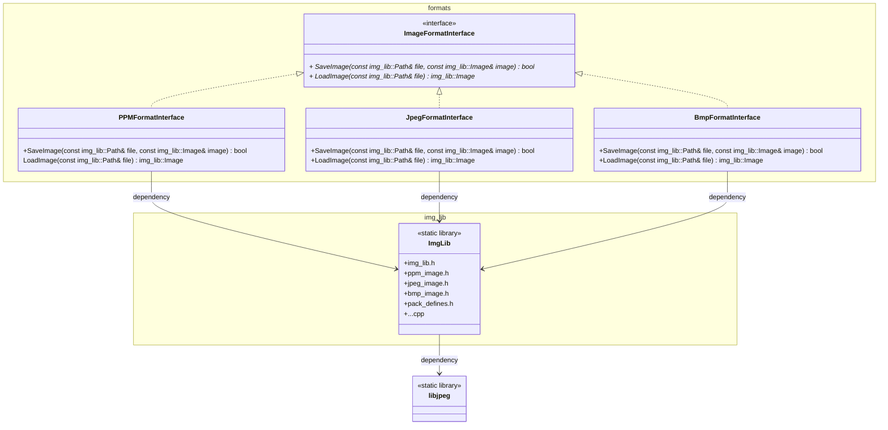

# Image-converter

Проект универсального конвертера изображений, который поддерживает конвертацию изображений трёх форматов: BMP, JPEG, PPM.

## Структура проекта


<br>

### Основные структурные элементы

В проекте реализован интерфейс ImageFormatInterface для чтения и сохранения изображений. Классы PPMFormatInterface, JpegFormatInterface, BmpFormatInterface реализуют виртуальные методы интерфейса для конвертации изображений соответствующего формата. 
В процессе сборки из файлов реализации, связанных с обработкой изображений создается статическая библиотека ImgLib. Для обработки изображений в формате jpeg подключается дополнительная сторонняя библиотека libjpeg, которая представлена в одноименной директории.  

### Используемые инструменты

- OC: Ubuntu 22.04
- cmake: 3.22.1
- компилятор: gcc 11.4.0
- стандарт языка: С++17
- отладчик: GNU gdb 12.1

## Download

Скачать репозиторий можно с помощью команды:

```
git clone git@github.com:alexkozlovvv/cpp-image-converter.git
```

## Usage

При сборке проекта с помощью Cmake необходимо указать конфигурацию сборки параметром -DCMAKE_BUILD_TYPE, а так же путь к директории статической библиотеки libjpeg. При этом предвартельно желательно создать директорию, из которой будут вызываться команды сборки. Для конфигурации debug команды будут выглядеть так:

```
cmake ../ImgConverter -DCMAKE_BUILD_TYPE=Debug -DLIBJPEG_DIR=<путь до директории libjpeg>
cmake --build .
```
По окончании сборки должен появиться исполняемый файл imgconv. 
При запуске программы необходимо передать два параметра. Первый параметр содержит путь до входного изображения. Второй параметр содержит путь до выходного. Выходное изображение будет создано автоматически.

```
./imgconv <path to input image> <path to output image>
```


